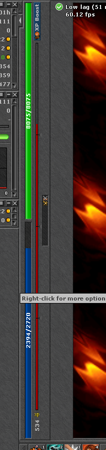

# simple autohealer

It's meant to work with the life and mana bars at this position:

Please note that the position in pixels will vary depending on OS and monitor size, theres a method commented out in the index.js to assist you in collecting this data, and then update the `config.json` with it.

Just setup the hotkeys in the `config.json` and run it.

PS.: you might need to force npm install with python 2.7:
`npm i --python=python2.7`

Also double check the `robotjs` npm page and make sure you have all the necessary libraries intalled in your OS before running `npm install`

